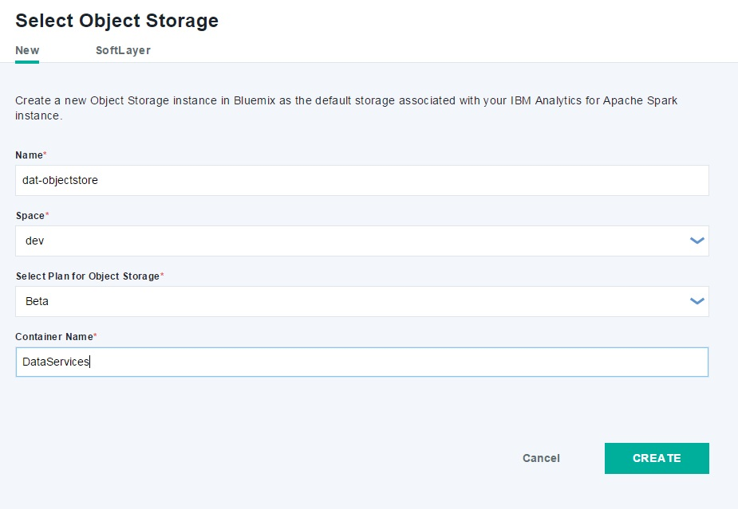
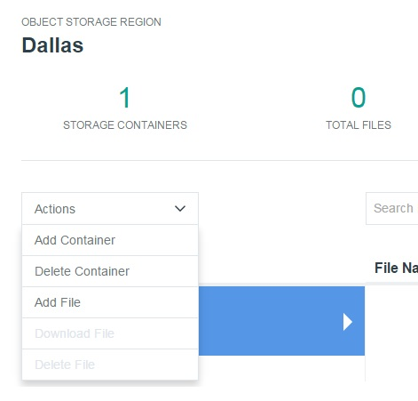
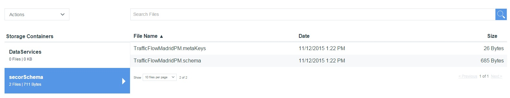
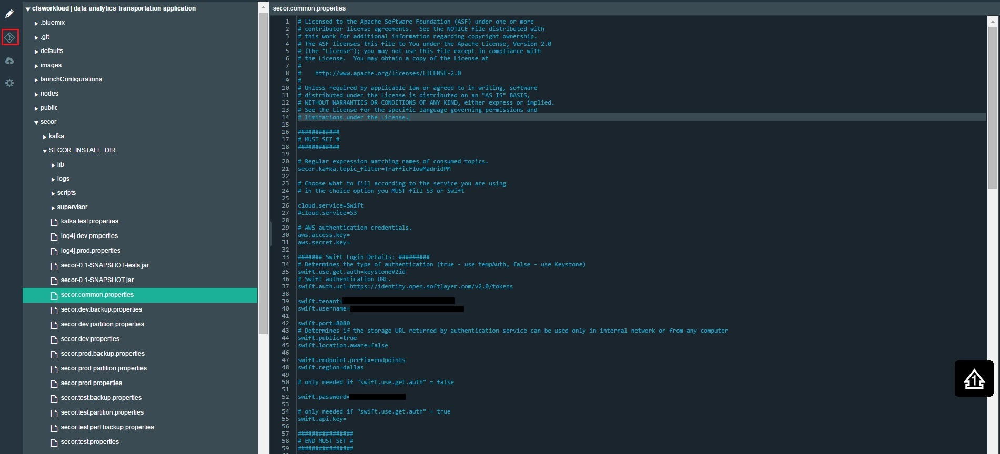
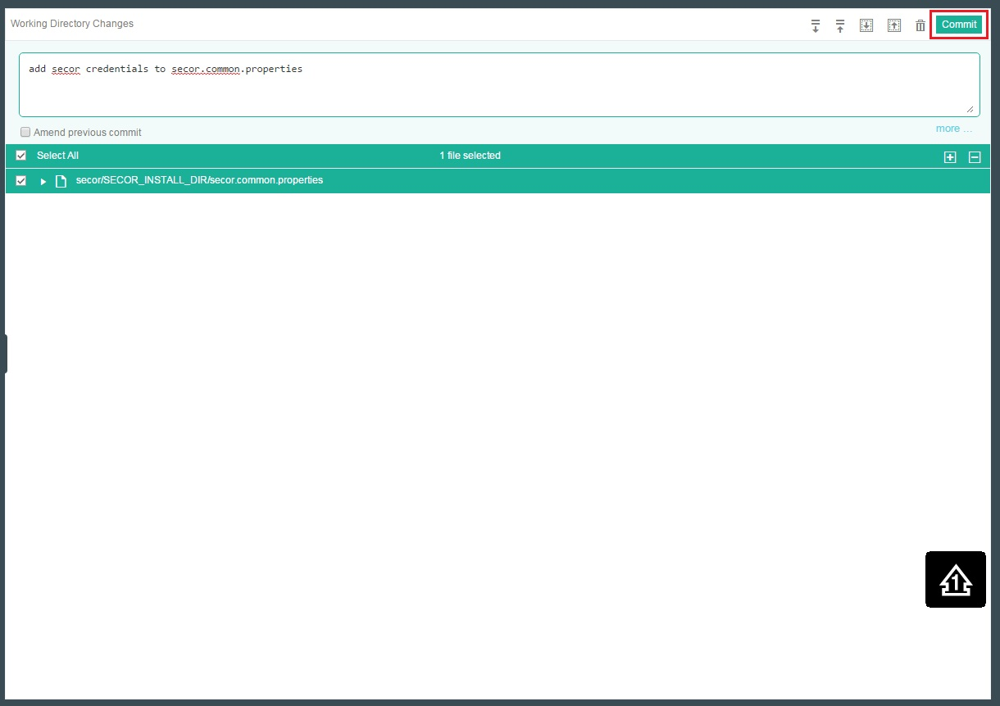
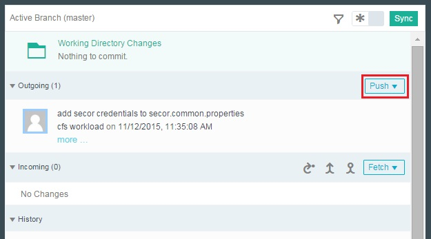
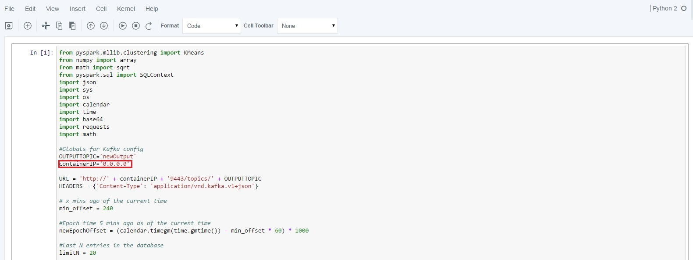
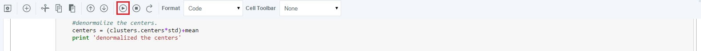

# Workload - Data Analytics Transportation

### Data Analytics Transportation sample app

The Data Analytics Transportation app demonstrates
a data analytics workflow that uses Bluemix's **Node-RED**, **Object Storage**, and **Spark**. Real-time data is retrieved from a transportation
system in Madrid and goes through the flow: Node-RED --> Kafka --> Secor --> Object Storage --> Spark --> Kafka --> Freeboard from Node-RED.

## Introduction

After registering for Bluemix and DevOps Services, you can deploy the Data Analytics Transportation app into your personal DevOps space.

## Sign up and log into Bluemix and DevOps

Sign up for Bluemix at https://console.ng.bluemix.net and DevOps Services at https://hub.jazz.net.
When you sign up, you'll create an IBM ID, create an alias, and register with Bluemix.

## Deploy to Bluemix

You can use the **Deploy to Bluemix** button below to deploy the app to DevOps Services.

 

This button will deploy the source code to your personal DevOps space, attach the Bluemix services. It will also create a container with the MQTT, Kafka, Kafka Rest Proxy, and Secor services using the Continuous Delivery Pipeline.

After you start the deployment, you'll request an external IP address to use in the container pipeline.

## Set up your external IP with the container pipeline

To request an external IP address, you will need to install the ICE CLI provided by Bluemix. The ICE CLI can be found at the website below.

https://www.ng.bluemix.net/docs/containers/container_cli_ov.html

Once installed:

1. Log into your Bluemix account and space.

		ice login

2. Request an external IP address. This will be used later in the Delivery Pipeline.

		ice ip request
3. Once the Deploy to Bluemix process has finished, click **My Projects** at the top right of your screen and select your app.
4. Click **BUILD & DEPLOY** at the top right.
This will bring up the pipeline created for you during the Deploy to Bluemix process. At this point, the part of the pipeline that creates the Node-RED Cloud Foundry app should be running.

 
5. Select **Edit** on the **Container Deploy** tile on the pipeline and then select **Configure Stage**.
6. In the **Optional deploy arguments** field, put the external IP from your container in the environment variable **ADVERTISED_HOST**.
7. Select **SAVE**.

## Set up Spark

First, you're going to create an instance of Object Storage.
1. In your Bluemix Dashboard, select your app. This will take you to your app-specific dashboard.
2. Select the **Apache Spark** service.
2. Click **Open** at the top right.
3. On the top, select **Object Storage**.
4. Click **Add Object Storage**.
5. Name your Object Storage instance, and change your **Container Name** to **DataServices**.

 
6. Click **CREATE**.
7. Click on the recently created Object Storage instance.
8. From the **Actions** drop down menu on the top left, select **Add Container** and name it **secorSchema**.

 
9. Go back to your project in DevOps Services, and download **secor/TrafficFlowMadridPM.metaKeys** and **secor/TrafficFlowMadridPM.schema** to your local machine.
10. Return to your Object Storage, select your **secorSchema** container, and in the **Actions** drop down menu, select **Add File**.
11. Select the **TrafficFlowMadridPM.metaKeys** file you downloaded to your local machine.
12. Follow the same steps to upload **TrafficFlowMadridPM.schema**.

 

##### Add your IPython notebook to Spark
1. In DevOps Services, select your project and download **dat_notebook.ipynb** to your local machine.
2. Return to your Spark instance, select **Open**, and select **New Notebook**.
3. Select **From File** from the top. Name the notebook and give it a description.
4. Click on **Choose File** and select the notebook downloaded to your local machine.
5. Select **Create Notebook** from the bottom right.

## Set up Object Storage credentials

You'll need to retrieve your Object Storage service credentials from Bluemix, then add them to Secor.

1. In the Bluemix Dashboard, select the Object Storage service tile, and click on **Service Credentials** on the left panel.
2. Navigate to your project within DevOps Services.
3. Click **EDIT CODE** on the top right of the screen to take you to the web IDE.
4. Select the **/secor/SECOR_INSTALL_DIR/secor.common.properties** file on the left.
5. Use the credentials you received from Object Storage to assign the fields listed below.
		swift.tenant=<projectid from object storage>
		swift.username=<userid from object storage>
		swift.password=<password from object storage>

 

6. At the top left corner, click the **Git** icon.

 

7. Add a commit message, and click **Commit** on the top right corner.

 

8. After adding a message, click the **Push** button on the left panel.

 

  Now you have your Secor configured with Object Storage!

## Start the container portion of the pipeline

1. Return to the Delivery Pipeline in your DevOps Services project.
2. Click the **Run Stage** icon on the **Container Build** tile. This will kick off the container build and deployment. You can monitor the status in **View logs and history** on each pipeline tile.
3. Once the build is done, return to your command line with the ICE CLI and run:

		ice bind <external IP put in pipeline> <name of container produced in the Container Deploy stage>

## Set up your external IP with Node-RED

Now, you'll add the external IP address of your container to Node-RED.

1. Access your Node-RED. You will see the customized flow. The initial node is not connected, so the flow is not initialized until the external IP of your container is added.
Connect the initial **Every 5 minutes** node to the **Get traffic status from Madrid** node.

 
2. Double click on the **Send to Kafka** node at the far right to edit the Kafka producer node. Click on the pencil button to edit the currently selected Zookeeper Server.
3. In the **Edit kafka-credentials config node** window, modify the Zookeeper Server Address field to the IP address of your new container. Only the IP address is required.
4. Press **Update**.
Note: There is another Kafka node that has an IP reference, but it will also be changed here if you are only editing the default Zookeeper Server Address.
4. Click **OK** to close the **Edit Kafka producer node** window.
5. Click **Deploy** in the upper right to deploy the updated flow to Node-RED.

## Start the Apache Spark script
1. Go to the project in your Dashboard, and choose **Apache Spark**.
2. Click **OPEN** and select your Apache Spark instance.
3. Click on the notebook you created.
4. In the script, update the **0.0.0.0** to your own container IP address.

 

6. Click **Play** on the top.

 

## Access Freeboard from Node-RED

At the end of the flow, the data ends up in Freeboard and presents you with your generated metrics.
Once data is processed through the flow and the rest of the solution, the results can be seen in your Freeboard.

1. To get to your Freeboard, go to the Bluemix route.
e.g. http://data-analytics-transportation-application.mybluemix.net/

	

2. Once the webpage loads, click **Go to your Freeboard dashboard** to load your newly configured Freeboard.

  
