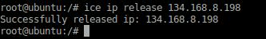

# Workload - Data and Analytics Transportation


### Data and Analytics Transportation sample app


The Data and Analytics Transportation app demonstrates
a data analytics workflow that uses a combination of Bluemix and open source applications to create a visualization of information.
The data is retrieved from a transportation system in Madrid, filtered and then saved in Object Storage. The information is then analyzed, and the results are presented in a Node-RED Freeboard.


## Introduction

After registering for Bluemix and DevOps Services, you can deploy the Data and Analytics Transportation app into your personal DevOps space.

## Sign up and log into Bluemix and DevOpss

Sign up for Bluemix at https://console.ng.bluemix.net and DevOps Services at https://hub.jazz.net.
When you sign up, you'll create an IBM ID, create an alias, and register with Bluemix.


## Make sure a Public IP is avaiable in your Bluemix space
 
  When you use the Deploy to Bluemix button, later in the guide, it will try and request a new public IP. We need to make sure we have an available IP using the ICE CLI

 In order to check your public IP addresses, you'll need to install the ICE CLI, which can be found at the website below.

https://www.ng.bluemix.net/docs/containers/container_cli_ov.html

Once installed:

1. Log into your Bluemix account and space that you will deploy DAT to.
```
ice login
```
2. List your current external IPs
```
ice ip list
```

This will list ur current Public IPs assigned to your bluemix space. You need atleast one less than you max quota for your space, which can be found in your bluemix dashboard under **Containers** at the top.
To release an IP, to make room , you can type -


 	ice ip release < public IP 
 	
Example in a case where our max quota is 2 public IPs for **Containers**


This case shows two IPs already allocated and our pipeline needs one available, so we need to release one.



We have completed everything needed to start our **Deploy to Bluemix** button

## Deploy to Bluemix

Click the **Deploy to Bluemix** button below to deploy the source code to DevOps Services and create the needed Cloud Foundry and Container applications. This deployment will also create the services **Object-Storage**, **Cloudant**, and **Spark** and bind them to your Cloud Foundry application that will run **Node-RED**

 [](https://bluemix.net/deploy?repository=https://hub.jazz.net/git/wprichar/data-analytics-transportation-application-wprichar-119)

After the deployment page has passed **Configuring pipeline...** you can monitor the deployment by selecting your newly created project in your DevOps Services in **MY PROJECTS** and select **BUILD & DEPLOY** at top right. This will show your newly created pipeline being used for the deployment. You can monitor the stages by selecting **View logs and history**


## Set up Object Storage

1. From your Cloud Foundry's dashboard select **DAT-objectstorage**
2. From the **Actions** drop down menu on the top left, select **Add Container** and name it **secorSchema**.
3. Do step 2 again with the container name **DataServices** this time
3. Go back to your project in DevOps Services, and download **secor/DataServices.metaKeys** and **secor/DataServices.schema** to your local machine.
4. Return to your Object Storage, select your **secorSchema** container, and from the **Actions** drop down menu, select **Add File**.
5. Select the **DataServices.metaKeys** file you downloaded to your local machine.
6. Follow the same steps to upload **DataServices.schema**.


## Add your Object Storage and IPython notebook to Spark

1. In DevOps Services, select your project and download **dat_notebook.ipynb** to your local machine.
2. Inside the **Spark** service click **Open** at the top right.
3. Select your newly created **DAT-spark** instance
3. At the top select **Object Storage** and select **ADD OBJECT STORAGE**
5. Select **Bluemix** and the top 
6. Select **DAT-objectstorage** in the options and the container **DataServices** and press **SELECT**
2. Click **My Notebooks** at the top and select **New Notebook**.
3. Select **From File** at the top. Name the notebook and give it a description.
4. Click on **Choose File** and select the **dat_notebook.ipynb** downloaded to your local machine.
5. Select **Create Notebook** from the bottom right.

We have now set up your spark.

## Set up your external IP with Node-RED

Now, you'll add the external IP address of your container to Node-RED.

1. Return to your application dashboard and select the route for your application at top to access your Node-RED.
2. Click go to your Node-RED flow editor. You will see the customized flow. The initial node is not connected, so the flow is not initialized until the external IP of your container is added.
3. Connect the initial **Every 5 minutes** node to the **Get traffic status from Madrid** node.

 
2. Double click on the **Send to Kafka** node at the far right to edit the Kafka producer node. Click the **pencil** icon to edit the currently selected Zookeeper Server.
3. In the **Edit kafka-credentials config node** window, modify the **Zookeeper Server Address** field to the public IP address of your new container found in your Bluemix DASHBOARD under **Containers** with the naming scheme **Quadthreat_<a number>**. Only the IP address is required.
4. Press **Update**.
Note: There is another Kafka node that has an IP reference, but it will also be changed here if you are only editing the default Zookeeper Server Address.
4. Click **OK** to close the window.
5. Click **Deploy** in the upper right to deploy the updated flow to Node-RED.


#### Start the Apache Spark script

1. Go to the project in your Dashboard, and choose **Apache Spark**.
2. Click **OPEN** and select your Apache Spark instance.
3. Click on the notebook you created.
4. In the script, update **0.0.0.0** to your own container public IP address.
5. Click **Play** at the top.


## Access Freeboard from Node-RED

Once data is processed, you will be able to see a visual representation of real-time traffic information displayed in a Node-RED Freeboard. The information on the Freeboard is collected from three separate areas of Madrid and the three data points are simultaneously displayed. You are able to see the live feed from traffic cameras, as well as, the speed and intensity of traffic and their analyzed thresholds.

1. To get to your Freeboard, go to the Bluemix route.
e.g. http://data-analytics-transportation-application.mybluemix.net/

	

2. Once the webpage loads, click **Go to your Freeboard dashboard** to load your newly configured Freeboard.

  

## Reference

The Data and Analytics Transportation sample app combines several different Bluemix and open source applications.

##### Open source

Apache Kafka: a message hub that provides a commit log of updates.

Secor: a reliable logging service that takes information from Kafka and converts it into parquet files. Those files are then placed into Object Storage within Bluemix.

##### Bluemix

Apache Spark: a data processing engine.

IPython: an interactive computational environment where you can combine coding, text, math, and media.

Node-RED: a tool for wiring together the Internet of Things.

Node-RED Freeboard: a data visualization dashboard.

Object Storage: uses unique ID's and containers to store information in a scalable way.
