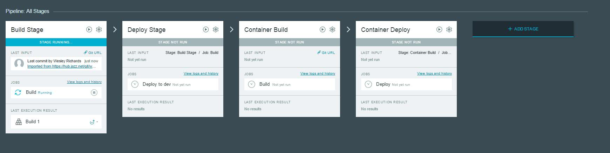
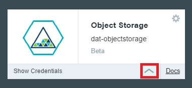
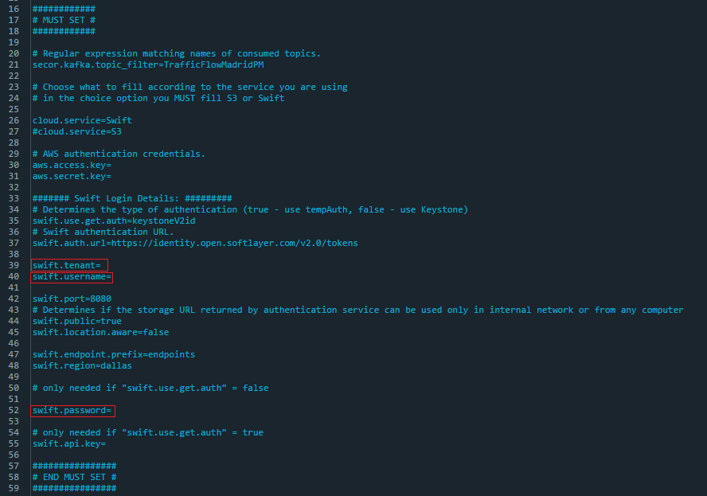
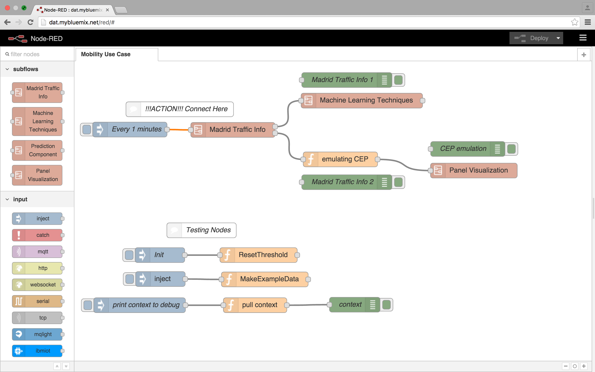
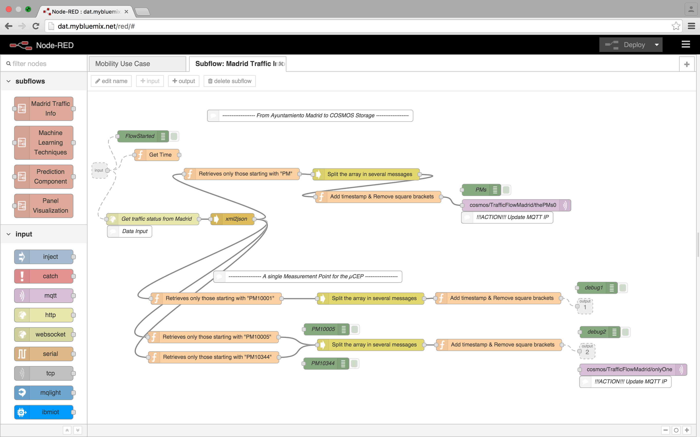
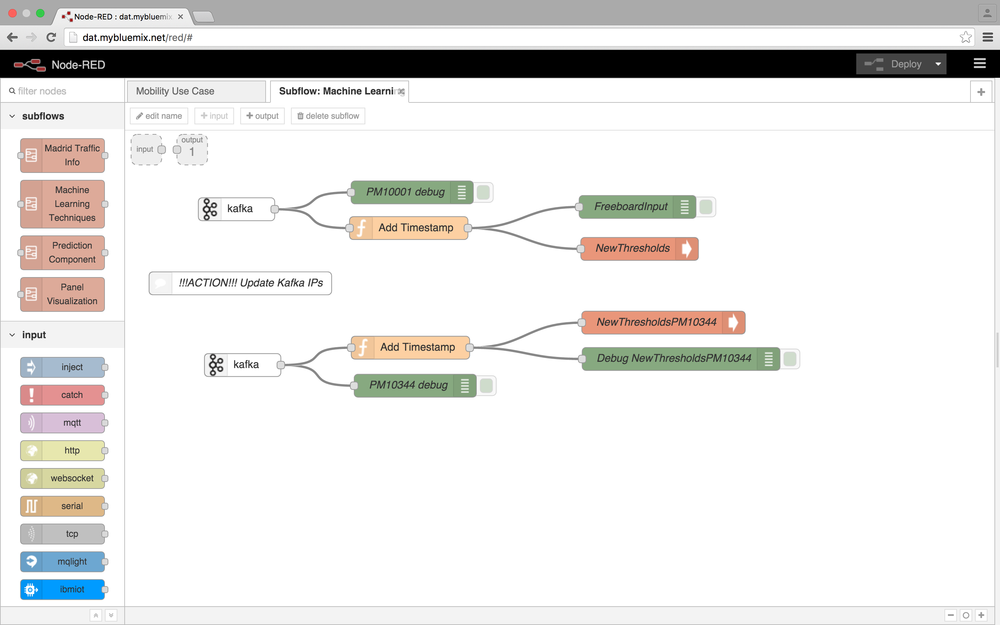
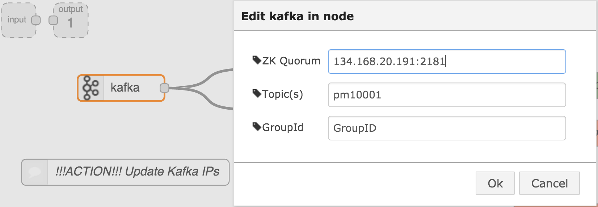
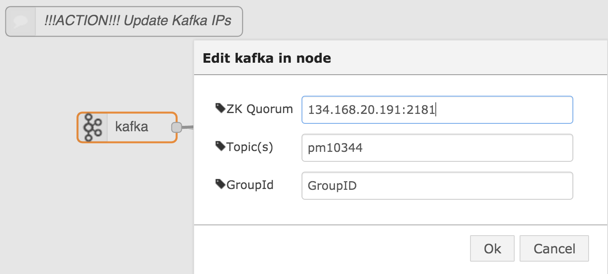
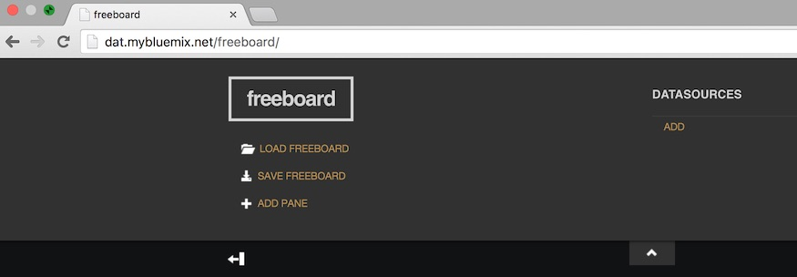
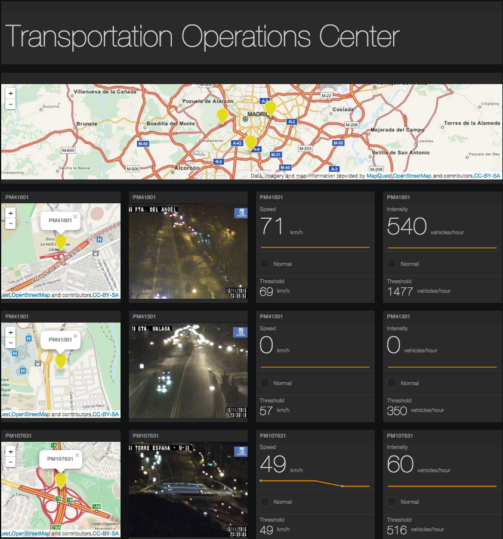

# Workload - Data Analytics Transportation 

###Data Analytics Transportation application example implemented in containers and cloud foundry

The Data Analytics Transportation application demonstrates
a data analytics workflow utilizing Bluemix's **Node-Red**, **Object Storage (v1)**, and **Spark**. Real time data is retrieved from a transportation
system in Madrid and goes through the flow Node-Red --> Kafka --> Secor --> Object Storage --> Spark --> Kafka --> FreeBoard from Node-Red

## Introduction

The Data Analytics Transportation application has been created so you can deploy it into your personal space
after signing up for Bluemix and the DevOps Services. 

## Sign up for and log into Bluemix and DevOps

Sign up for Bluemix at https://console.ng.bluemix.net and DevOps Services at https://hub.jazz.net.
When you sign up, you'll create an IBM ID, create an alias, and register with Bluemix.

## Deploy to Bluemix

Utilize the **Deploy to Bluemix** button below to deploy the application to your personal work space.

This button will deploy the source code to your personal hub.jazz.net repo, create the bluemix services, and generate a pipeline that will be used to create the 
Node-Red cloud foundry app and the four-in-one ( MQTT, Kafka, Kafka Rest Proxy, and Secor) container.

Once you start the deploy you can spend your time requesting an external IP to be used in container pipeline.

## Request external IP for container

For this step you will need the ICE cli provided by Bluemix to request an external IP. To install this follow the ice installation section at - 

https://www.ng.bluemix.net/docs/containers/container_cli_ov.html

Once installed -

1. Log into your Bluemix account and space 

		ice login
2. Request an external IP to be used later in container pipeline
		ice ip request
		
Take note of the external IP recieved for later use

## Put external IP into pipeline

Once your **deploy to bluemix** button process has finished - 

1. Navigate to http://hub.jazz.net and select MY PROJECTS at the top right of screen
2. Select the project with the host name your provided during the **Deploy to Bluemix** button process.
3. Select **BUILD & DEPLOY** at the top right

This will bring up the pipeline created for your during the **Deploy to Bluemix** button process. The first half of the pipeline that creates the Node-Red
cloud foundry application should be running or finished.

 

4. Select the edit gear of the **Container Deploy** tile of the pipeline and select **Configure Stage**.
5. In the **Optional deploy arguments** box in the environment variable **ADVERTISED_HOST** put in the external IP you recieved from the ICE request
6. Select **SAVE**

## Retrieve Object Storage credentials

We need to grab to grab our credentials to the newly created Object Storage attached to our application

1. Navigate to your **DASHBOARD** at http://console.ng.bluemix.net
2. Select your newly created application from the **Deploy to Bluemix** button which will take you to your application's dashboard
2. Below the **Object Storage** tile select the up arrow icon to expand that shows the Object Storage credentials

 

Take not of the credentials to be used for the next step.

## Add Object Storage credentials to Secor

1. Navigate back to your http://hub.jazz.net project
2. Select **EDIT CODE** in the top right of the screen to take you to your Web IDE
3. Select /secor/SECOR_INSTALL_DIR/secor.common.properties file on the left
4. Assign the fields listed below with the credentials you recieved from Object Storage (v1)

		swift.tenant=<projectid from object storage>
		swift.username=<userid from object storage>
		swift.password=<password from object storage>
5. Select File and **Save**

## Start Container portion of the pipeline

1. Return to your pipeline in your jazz hub project
2. Click the play button on the **Container Build** tile

This will kick off the Container build and deploy. You can monitor the status in **View logs and history** on each pipeline tile. Once it is done return to your command line with the ICE CLI and run

		ice bind <external IP put in pipeline> <name of container produced in **Container Deploy** stage>
		

## Add external IP to Node-Red

We now will set out to add the external IP of the newly created container to our Node-Red.

1. Access your Node-Red. You will see the customized flow. The initial node is not connected so the flow is not intialized before the newly created container IP is updated in the flow.
Connect the initial node to the "Machine Traffic Info" subflow node.

2. Double click the "Machine Traffic Info" subflow from the list of subflows on the left to enter the subflow. If you double click on the “Machine Traffic Info” subflow node from the main flow, press the “Edit flow” button in the pop-up window to enter the subflow.

3. There are two mqtt nodes in the “Machine Traffic Info” subflow. Double click on the “cosmos/TrafficFlowMadrid/thePMs0” node on the right side of the flow to edit it. 

4. Click on the pencil button to the right of the of the “Broker” field to edit the current broker and replace the current IP with the external IP of the newly created container. Press the “Update” button to save the changes.

The second mqtt node, “cosmos/TrafficFlowMadrid/onlyOne”, is an optional node for testing but the IP address will need to be modified as well.

5. Next, double click on the “Machine Learning Techniques” subflow from the list of subflows on the left to enter the subflow. There are two kafka nodes in this subflow that need to be edited for the new IP of the newly created container.

6. Double click on the top kafka node to edit the node. Change the IP in the “ZK Quorum” field to the new container IP and press “Ok” to save the change.

7. Similarly, double click on the bottom kafka node and change the IP in the “ZK Quorum” field to the new container IP. Press “Ok” to save the change.

8. Press the “Deploy” button at the upper right to deploy the updated flow to Node-Red.

## Set up Spark

We will set up the Spark service to read from our object store and push back to kafka on our container.

## Access freeboard from Node-Red to see data coming in from flow

Add the end of the flow our data ends up at freeboard and presents us with our generated metrics.

1. Once data is processed through the flow and the rest of the solution, the results can be seen in freeboard. To get to freeboard, append “freeboard” to the Bluemix route. <route>/freeboard
e.g. http://dat.mybluemix.net/freeboard/

	

2. In the empty freeboard screen, you will need to load the freeboard .json file to see a visual representation of the data analytics. Download the freeboard_start-19995.json file from the .node-red folder in this repository. This file will be used as the configuration file for freeboard.

3. Press the "LOAD FREEBOARD" button to select the freeboard_start-19995.json file you previously downloaded to add to freeboard.

	You should now see the newly configured freeboard.

