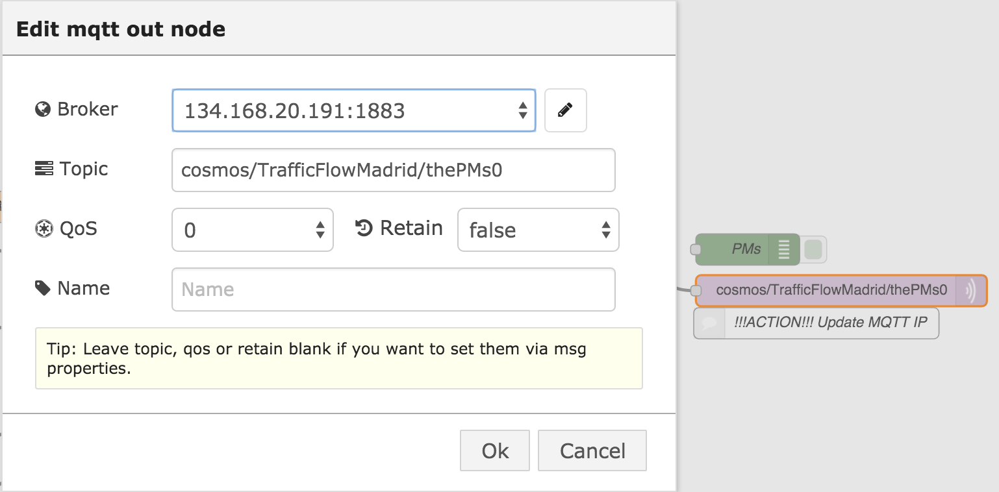
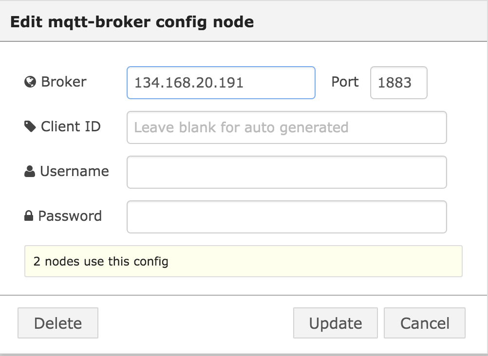
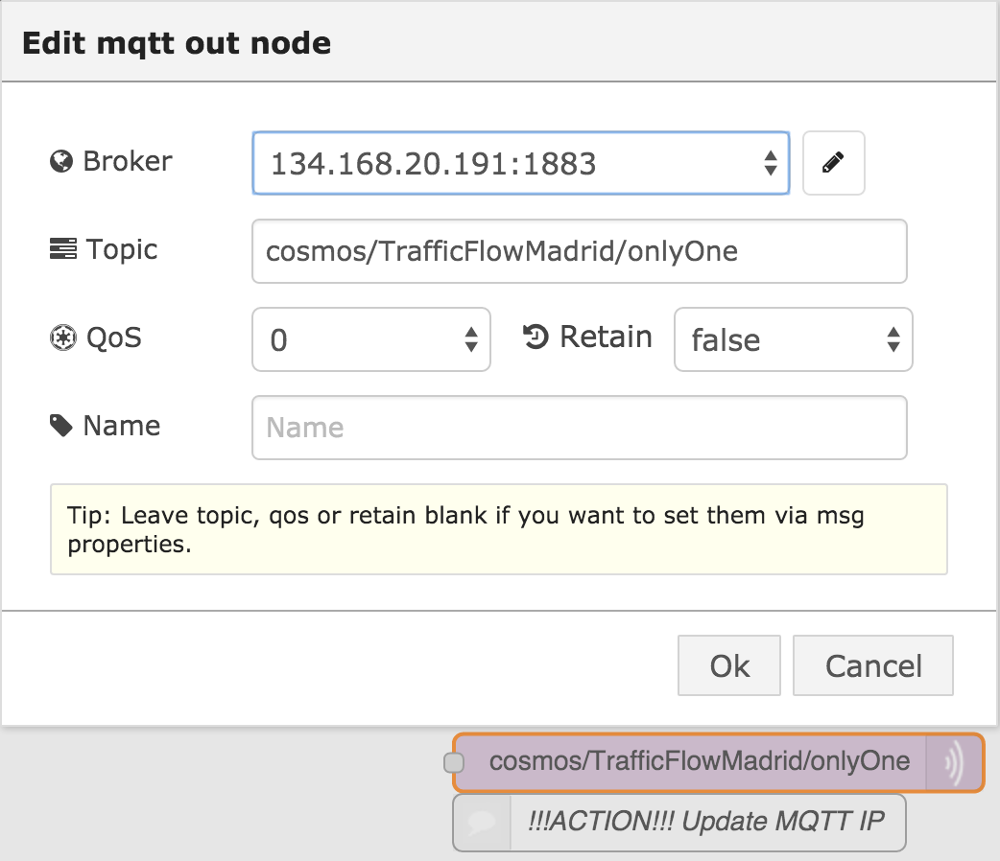

# Workload - Data Analytics Transportation 

###Data Analytics Transportation application example implemented in containers and cloud foundry

The Data Analytics Transportation application demonstrates
a data analytics workflow utilizing Bluemix's **Node-Red**.

## Introduction

The Data Analytics Transportation application has been created so you can deploy it into your personal space
after signing up for Bluemix and the DevOps Services. 

## Sign up for and log into Bluemix and DevOps

Sign up for Bluemix at https://console.ng.bluemix.net and DevOps Services at https://hub.jazz.net.
When you sign up, you'll create an IBM ID, create an alias, and register with Bluemix.

## Deploy to Bluemix

Utilize the **Deploy to Bluemix** button below to deploy the application to your personal work space.

<<<<<<< HEAD

## Request external IP for container

You will now bind services to your starter
bridge application.

## Put external IP into pipeline

1. In the left sidebar, select **Overview** to take you into the application's dashboard where you can
add or bind services.

You have successfully deployed and bound an instance of Object Storage (v2) to your starter bridge application.

## Retrieve Object Storage (v1) credentials

We need to grab to grab our credentials to the newly created Object Storage attached to our application

1. Return to the Bluemix Dashboard by selecting **DASHBOARD** at top of the page.
2. Click your newly created application, which will take you to your application's dashboard

## Add Object Storage (v1) credentials to Secor

We will now add our object storage credentials to the Secor common properties so Secor can push its logs to object store retrieved from Kafka

1. Go to your **Web IDE**

## Add external IP to Node-Red

We now will set out to add the external IP of the newly created container to our node red.

1. Access your node red. 

## Set up Spark

We will set up the Spark service to read from our object store and push back to kafka on our container.

## Access freeboard from Node-Red to see data coming in from flow

Add the end of the flow our data ends up at free board and presents us with our generated metrics.
=======
 )

## Request external IP for container

You will now bind services to your starter
bridge application.

## Put external IP into pipeline

1. In the left sidebar, select **Overview** to take you into the application's dashboard where you can
add or bind services.

You have successfully deployed and bound an instance of Object Storage (v2) to your starter bridge application.

## Retrieve Object Storage (v1) credentials

We need to grab to grab our credentials to the newly created Object Storage attached to our application

1. Return to the Bluemix Dashboard by selecting **DASHBOARD** at top of the page.
2. Click your newly created application, which will take you to your application's dashboard

## Add Object Storage (v1) credentials to Secor

We will now add our object storage credentials to the Secor common properties so Secor can push its logs to object store retrieved from Kafka

1. Go to your **Web IDE**

## Add external IP to Node-Red

We now will set out to add the external IP of the newly created container to our node red.

1. Access your Node-Red. You will see the customized flow. The initial node is not connected so the flow is not intialized before the newly created container IP is updated in the flow.
Connect the initial node to the "Machine Traffic Info" subflow node.

2. Double click the "Machine Traffic Info" subflow from the list of subflows on the left to enter the subflow. If you double click on the “Machine Traffic Info” subflow node from the main flow, press the “Edit flow” button in the pop-up window to enter the subflow.

3. There are two mqtt nodes in the “Machine Traffic Info” subflow. Double click on the “cosmos/TrafficFlowMadrid/thePMs0” node on the right side of the flow to edit it. 

4. Click on the pencil button to the right of the of the “Broker” field to edit the current broker and replace the current IP with the external IP of the newly created container. Press the “Update” button to save the changes.

The second mqtt node, “cosmos/TrafficFlowMadrid/onlyOne”, is an optional node for testing but the IP address will need to be modified as well.

5. Next, double click on the “Machine Learning Techniques” subflow from the list of subflows on the left to enter the subflow. There are two kafka nodes in this subflow that need to be edited for the new IP of the newly created container.

6. Double click on the top kafka node to edit the node. Change the IP in the “ZK Quorum” field to the new container IP and press “Ok” to save the change.

7. Similarly, double click on the bottom kafka node and change the IP in the “ZK Quorum” field to the new container IP. Press “Ok” to save the change.

8. Press the “Deploy” button at the upper right to deploy the updated flow to Node-Red.

## Set up Spark

We will set up the Spark service to read from our object store and push back to kafka on our container.

## Access freeboard from Node-Red to see data coming in from flow

Add the end of the flow our data ends up at free board and presents us with our generated metrics. 
>>>>>>> e469e910f9cb1730c1b7d63535f41f15b6cc2dd8
