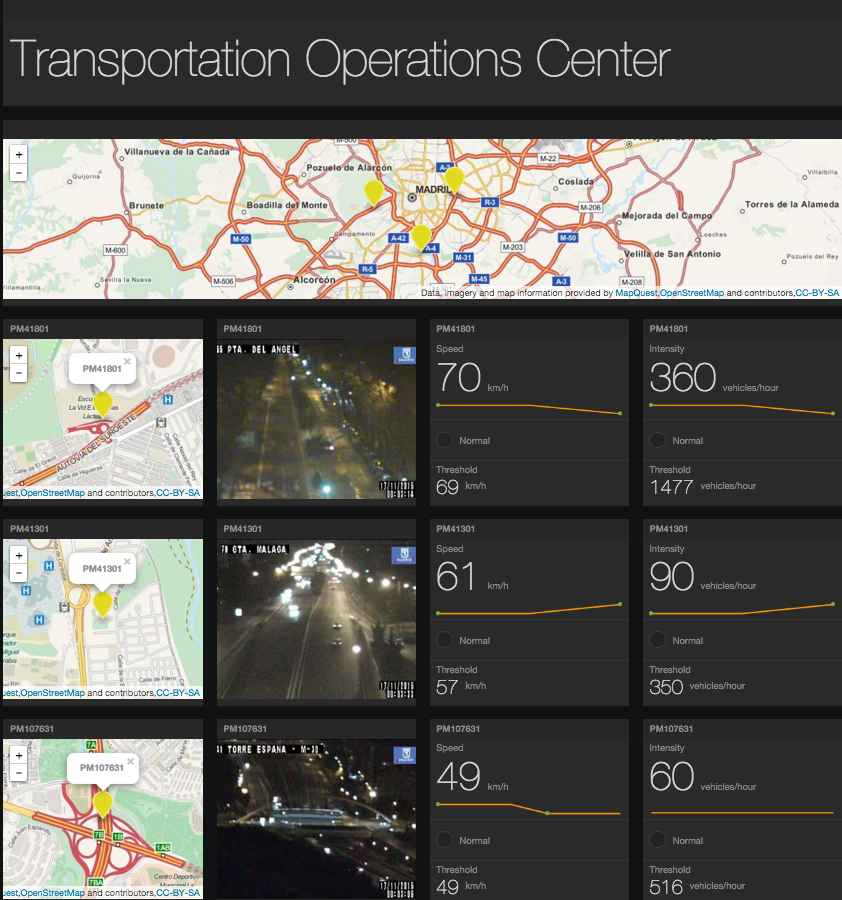

# Workload - Data Analytics Transportation 

###Data Analytics Transportation application example implemented in containers and cloud foundry

The Data Analytics Transportation application demonstrates
a data analytics workflow utilizing Bluemix's **Node-Red**, **Object Storage (v1)**, and **Spark**. Real time data is retrieved from a transportation
system in Madrid and goes through the flow Node-Red --> Kafka --> Secor --> Object Storage --> Spark --> Kafka --> FreeBoard from Node-Red

## Introduction

The Data Analytics Transportation application has been created so you can deploy it into your personal space
after signing up for Bluemix and the DevOps Services. 

## Sign up for and log into Bluemix and DevOps

Sign up for Bluemix at https://console.ng.bluemix.net and DevOps Services at https://hub.jazz.net.
When you sign up, you'll create an IBM ID, create an alias, and register with Bluemix.

## Deploy to Bluemix

Utilize the **Deploy to Bluemix** button below to deploy the application to your personal work space.

This button will deploy the source code to your personal hub.jazz.net repo, create the bluemix services, and generate a pipeline that will be used to create the 
Node-Red cloud foundry app and the four-in-one ( MQTT, Kafka, Kafka Rest Proxy, and Secor) container.

Once you start the deploy you can spend your time requesting an external IP to be used in container pipeline.

## Request external IP for container

For this step you will need the ICE cli provided by Bluemix to request an external IP. To install this follow the ice installation section at - 

https://www.ng.bluemix.net/docs/containers/container_cli_ov.html

Once installed -

1. Log into your Bluemix account and space 

		ice login
2. Request an external IP to be used later in container pipeline
		ice ip request
		
Take note of the external IP recieved for later use

## Put external IP into pipeline

Once your **deploy to bluemix** button process has finished - 

1. Navigate to http://hub.jazz.net and select MY PROJECTS at the top right of screen
2. Select the project with the host name your provided during the **Deploy to Bluemix** button process.
3. Select **BUILD & DEPLOY** at the top right
This will bring up the pipeline created for your during the **Deploy to Bluemix** button process. The first half of the pipeline that creates the Node-Red
cloud foundry application should be running or finished. 

4. Select the edit gear of the **Container Deploy** tile of the pipeline and select **Configure Stage**.
5. In the **Optional deploy arguments** box in the environment variable **ADVERTISED_HOST** put in the external IP you recieved from the ICE request
6. Select **SAVE**

## Set up Spark

First, we are going to craete an instance of object storage
1. From your application's dashboard, select **Apache Spark** service
2. Select **Open** on the top right
3. On the top, select **Object Storage**
4. Click **Add Object Storage**
5. Name your Object Storage, and change the **Container Name** to **DataServices**

6. Select **CREATE**
7. Click on the new created Object Storage instance
8. In the **Actions** drop down menu on the top left, select **Add Container**, and name it **secorSchema**

9. Go back to your web IDE at hub.jazz.net, select your project, and download **secor/TrafficFlowMadridPM.metaKeys** and **secor/TrafficFlowMadridPM.schema** to your local machine
10. Return to your Object Storage, select your **secorSchema** container, and in the **Actions drop down menu**, select **Add File
11. Select **TrafficFlowMadridPM.metaKeys** file you downloaded to your local machine
12. Follow the same steps to upload **TrafficFlowMadridPM.schema**

Now we will add our IPython notebook to Spark
1. Go back to your web IDE at hub.jazz.net, select your project, and download **dat_notebook.ipynb** to your local machine
2. Return to your Spark instance, select **OPEN**, and select **NEW NOTEBOOK** 
3. Select **From File** on the top, name the notebook, and give it a description
4. Click on **Choose File**, and select the notebook downloaded to your local machine
5. Select **CREATE NOTEBOOK** on the bottom right

## Retrieve Object Storage credentials

We need to grab to grab our credentials to the newly created Object Storage attached to our application

1. Navigate to your **DASHBOARD** at http://console.ng.bluemix.net
2. Select your newly created OBject Storage in the Services category, and click on **Service Credentials** on the left panel

Take note of the credentials to be used for the next step.

## Add Object Storage credentials to Secor

1. Navigate back to your http://hub.jazz.net project
2. Select **EDIT CODE** in the top right of the screen to take you to your Web IDE
3. Select /secor/SECOR_INSTALL_DIR/secor.common.properties file on the left
4. Assign the fields listed below with the credentials you recieved from Object Storage
		swift.tenant=<projectid from object storage>
		swift.username=<userid from object storage>
		swift.password=<password from object storage>

5. On the top left corner, click the git icon                

6. On the right hand side, add the commit messages, and click commit on the top right corner

7. After adding the message, click on the push button on the left panel               

8. Now you have your Secor configued with Object Storage!

## Start Container portion of the pipeline

1. Return to your pipeline in your hub jazz project
2. Click the play button on the **Container Build** tile

This will kick off the Container build and deploy. You can monitor the status in **View logs and history** on each pipeline tile. Once it is done return to your command line with the ICE CLI and run

		ice bind <external IP put in pipeline> <name of container produced in **Container Deploy** stage>
		

## Add external IP of container to Node-Red

We now will set out to add the external IP of the newly created container to our Node-Red.

1. Access your Node-Red. You will see the customized flow. The initial node is not connected so the flow is not intialized before the newly created container IP is updated in the flow.
Connect the initial "Every 5 minutes" node to the "Get traffic status from Madrid" node.

2. Double click on the "Send to Kafka" node at the far right to edit the kafka producer node. Click on the pencil button to edit the currently selected Zookeeper Server.

3. In the "Edit kafka-credentials config node" window, modify the Zookeeper Server Address field to the new container IP. Only the IP address is required. Press "Update" to save the change.
Note: There is another kafka node that has an IP reference, but it will also be changed here if you are only editing the default Zookeeper Server Address.

4. Finally, click "Ok" button to close the "Edit kafka producer node" window.

5. Click the “Deploy” button at the upper right to deploy the updated flow to Node-Red.

## Start the Apache Spark script
1. Go to your project in your dashboard, and choose **Apache Spark**
2. Click **OPEN**, and select your Apache Spark instance
3. Click on the notebook you created
4. In the script, please update replace the **0.0.0.0** to your own container IP address.

6. Click Play button on the top

## Access freeboard from Node-Red to see data coming in from flow

At the end of the flow, our data ends up at freeboard and presents us with our generated metrics.
Once data is processed through the flow and the rest of the solution, the results can be seen in freeboard. 

1. To get to freeboard, go to the Bluemix route.
e.g. http://dat.mybluemix.net/

	

2. On the loaded webpage, you will see a "Go to your Freeboard dashboard" button. Press the button to load the provided freeboard dashboard.

	You should now see the newly configured freeboard.

